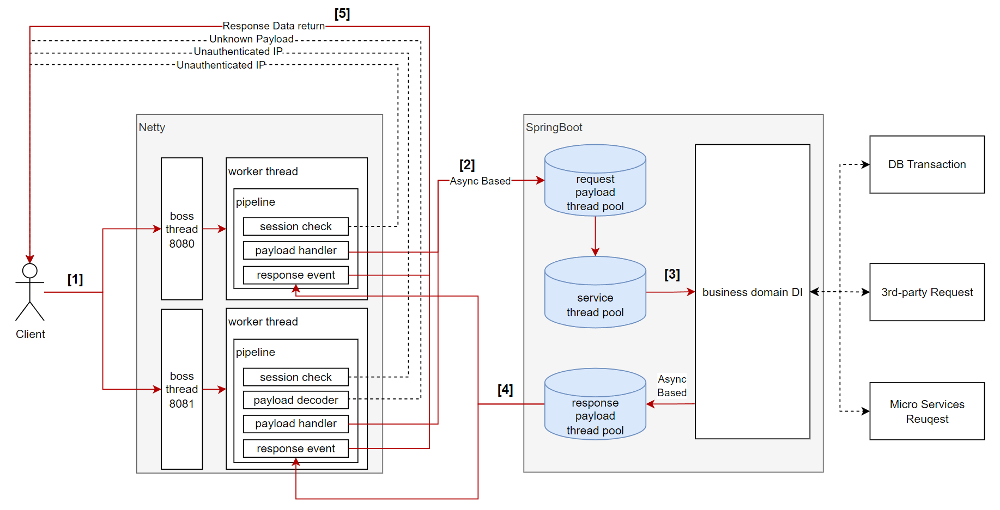

# Intro

TCP 기반 대용량 Socket/Http 통신 환경을 구성하고 다중포트를 구성하여 운영목적에 맞는 비지니스 로직 처리를 위한 시스템을 개발한다. 멀티스레딩 활용이 가능한 만큼 목적에 맞게 L7 Proxy 역할도 가능한 이점이 있다.

대용량 트래픽 처리를 위해 다중포트와 비동기 멀티스레딩에 최적화된 Netty Framework를 구성한다.

또한 SpringBoot를 적용해 라이브러리 관리를 위한 Gradle을 활용하고 더불어 Embedded Tomcat 을 활용해 HTTP 에 대응가능한 환경을 구성하고, Spring Container를 활용한 개발/운영에 최적화된 환경을 구성한다.

주요 항목은 아래와 같다.

- Configure Multiple Ports
- Configure Thread Pool Factory
- Configure Multiple DataSource

# 시스템구성

1. 8080, 8081 포트를 바인딩 합니다.
    1. boss-thread
        1. 8080 : 요청전문전체를 별도 조건 없이 수신
        2. 8081 : 요청전문전체를 약속된 규격에 따른 검토 진행
    2. worker-thread
        1. session check : 인증된 IP 대역 여부 검증
        2. payload decoder : 전문 규격 검토
        3. payload handler : 요청전문규격에 해당하는 비지니스로직 수행
        4. response event : 전문을 사용자에게 응답
2. 비동기 방식으로 SpringBoot 컨테이너에 전달
    1. worker thread의 사용자세션정보(ChannelHandlerContext.class)와 요청전문을 SpringBoot에 인계
    2. thread-pool
        1. request-payload-thread-pool : 요청정보를 캐시형태로 저장
        2. service-thread-pool : 요청정보캐시에 데이터가 있는 경우 queue형태로 정보를 인계
        3. response-payload-thread-pool : 응답정보를 캐시형태로 저장
3. 요청정보캐시 데이터를 SpringBoot Component에서 의존주입 받아 비지니스 로직 수행
    1. DB Transaction
    2. 3rd-party Request
    3. Micro Service Request
4. 응답정보를 취합하고 Netty에 인계
    1. write & flush 이벤트 호출
5. 정보응답(끝)

## 요구사항

- java 17+
- maven
- spring boot 3
- intellij
- h2db(embedded)
- redis(embedded)
